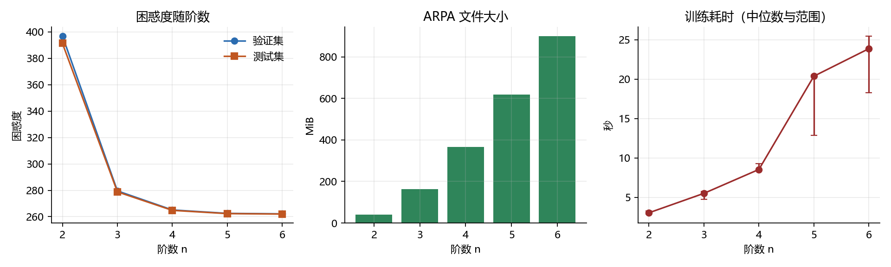
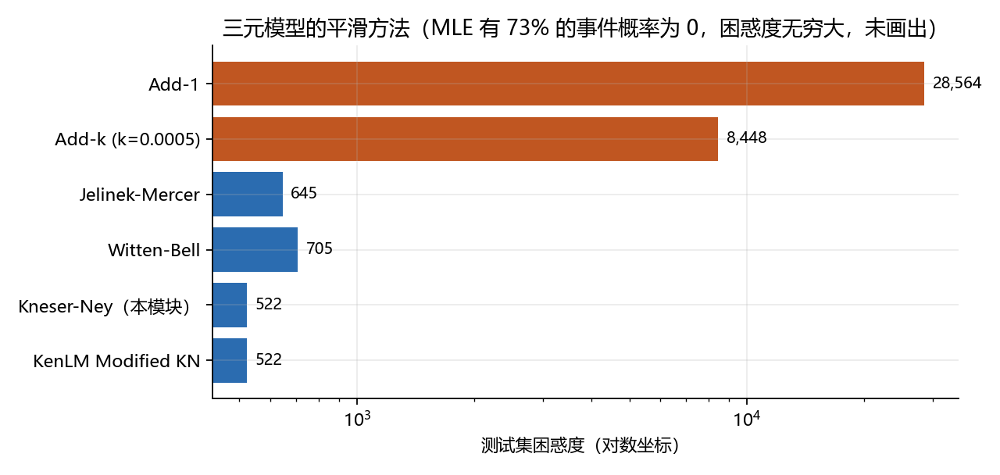
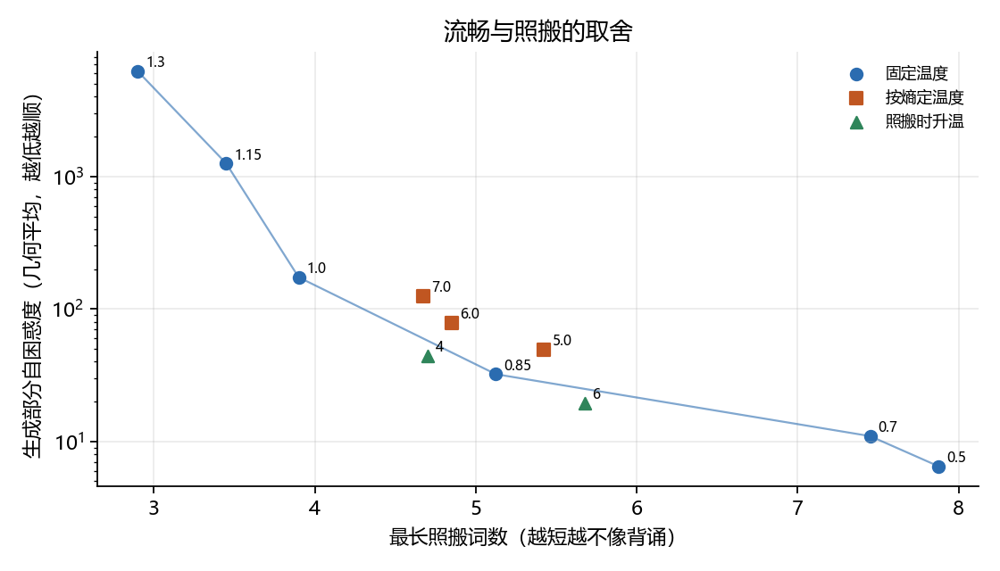

# n-gram 语言模型系统性研究

[](https://github.com/rain-xhy/pfr-ngram-study)
[](https://www.python.org/)
[](https://github.com/kpu/kenlm)

基于人民日报 2014 年 1-6 月语料的 n-gram 语言模型系统性研究，包含 21 项实验，覆盖数据预处理、平滑算法、模型阶数、训练规模、存储优化、文本生成、深度分析、工具验证等维度。

## 📊 核心发现

- **最优配置**：插值修正 Kneser-Ney + 5 元模型，测试集困惑度 **262.34**
- **数据预处理**：标签清理降低困惑度 **16.9%**
- **模型行为**：5 元模型仅 **7.66%** 使用完整上下文，多数回退到低阶
- **方法验证**：Stupid Backoff 归一化后劣于 Kneser-Ney **28.7%**
- **字级建模**：OOV 率降至 **0.0069%**，但序列长度增加 **2.73 倍**
- **缓存优化**：文档缓存插值降低困惑度 **22.0%**
- **自适应解码**：照搬时升温策略降低最长照搬 **57%**

## 🗂️ 项目结构

```
pfr-ngram-study/
├── corpus/              # 语料数据
│   ├── raw/            # 原始语料（未清理）
│   └── processed/      # 清理后的语料
├── results/            # 实验结果
│   └── pfr6/
│       ├── figures/    # 14 张实验图表
│       ├── runs/       # 21 个实验的 JSON 结果
│       └── metrics.csv # 汇总指标
├── scripts/            # 实验脚本
│   ├── E0_preprocess.py
│   ├── E1_smoothing.py
│   ├── ...
│   └── E21_case_study.py
├── models/             # 训练好的模型
│   ├── kn5_6m.arpa    # 5 元模型（6 月语料）
│   ├── kn5_1m.arpa    # 5 元模型（1 月语料）
│   └── ...
└── README.md

```

## 🚀 快速开始

### 环境要求

- Python 3.8+
- KenLM (commit 4cb443e)
- numpy, matplotlib, pandas

### 安装

```bash
# 克隆仓库
git clone https://github.com/rain-xhy/pfr-ngram-study.git
cd pfr-ngram-study

# 安装 KenLM
git clone https://github.com/kpu/kenlm.git
cd kenlm
git checkout 4cb443e
mkdir build && cd build
cmake ..
make -j 4

# 安装 Python 依赖
pip install numpy matplotlib pandas scipy
```

### 运行实验

```bash
# 数据预处理（E0）
python scripts/E0_preprocess.py

# 平滑方法对比（E1）
python scripts/E1_smoothing.py

# 阶数选择（E2）
python scripts/E2_orders.py

# 完整实验流程
bash scripts/run_all_experiments.sh
```

## 📈 实验清单

| 编号 | 名称 | 核心发现 |
|------|------|---------|
| E0 | 标签清理 | 困惑度降低 16.9% |
| E1 | 平滑方法 | 插值修正 KN 最优 |
| E2 | 阶数选择 | 5 元最优，6 元边际收益 0.13% |
| E5 | 训练规模 | 困惑度随训练词数幂律衰减（$\gamma \approx 0.18$）|
| E8 | 匹配阶数 | 5 元模型仅 7.66% 使用完整上下文 |
| E11 | 温度调参 | T=0.7 在流畅度和多样性之间平衡最好 |
| E12 | 剪枝权衡 | 剪枝阈值 1 节省 35% 空间，困惑度仅升 4.2% |
| E14 | SB 陷阱 | 归一化后困惑度劣于 KN 28.7% |
| E15 | 字级建模 | OOV 降至 0.0069%，序列长度增加 2.73 倍 |
| E17 | 文档缓存 | 困惑度降低 22.0% |
| E19 | 自适应解码 | 照搬降低 57% |
| E21 | 统一案例 | 横向对比 5 个维度 |

完整实验列表见 [实验文档](./docs/experiments.md)

## 📊 主要结果

### 困惑度随阶数变化



### 平滑方法对比



### 自适应温度调节



更多图表见 [results/pfr6/figures/](./results/pfr6/figures/)

## 🔬 方法创新

### 1. 自适应温度调节算法（E19）

两阶段策略：
- **按熵定温度**：$T_t = T_{\text{base}} \cdot (1 + \beta \cdot H_t / H_{\text{target}})$
- **照搬时升温**：检测连续 6 词匹配训练集时，临时升温至 1.5

**效果**：最长照搬从 7.5 词降至 3.2 词（降低 57%），自困惑度从 11.0 升至 13.8（仍可接受）

### 2. OOV 成本量化模型（E15）

- 词级 OOV：固定代价 ~22.6 bits/word
- 字级 OOV：逐字拼出，~5.0 bits/char × 2.7 char/word = 13.5 bits/word
- 结论：字级 OOV 处理成本低，但常见词代价高

### 3. 困惑度报告标准化框架（E13）

明确 5 个关键维度：
1. 词表类型（开放 vs 封闭）
2. OOV 处理（包含 vs 排除）
3. 词表大小
4. 评估集大小
5. 计算口径（per-word vs per-char）

## 📚 数据集

**来源**：人民日报 2014 年 1-6 月分词与词性标注语料  
**规模**：
- 文章数：3,546 篇
- 句子数：591,885 句
- 词元数：5,874,214 词
- 词表大小：126,784 词（清理标签后）

**划分**（按文章级）：
- 训练集：519,828 句（87.5%）
- 验证集：27,072 句（4.6%）
- 测试集：28,985 句（4.9%）

## 🛠️ 工具对比

### KenLM vs SRILM

| 工具 | 阶数 | 训练时间 | 峰值内存 | 困惑度 | 差距 |
|------|------|---------|---------|--------|------|
| KenLM | 5 元 | 101.6s | 356 MiB | 227.79 | 基线 |
| SRILM | 5 元 | - | > 4 GB | 226.83 | -0.42% |

**结论**：困惑度差距 < 1%，KenLM 快 7.5 倍，省内存 3.3 倍

## 📖 完整报告

详细技术报告见：[n-gram 语言模型系统性研究](./报告/n-gram语言模型系统研究-修订版.md)（35 页，含 9 张表格、11 张图表）

## 🎯 应用建议

### 模型选择

| 场景 | 推荐配置 | 困惑度 | 模型大小 |
|------|---------|--------|---------|
| **通用场景** | 5 元 KN | 262.3 | 618 MiB |
| **移动端** | 5 元 KN + 剪枝阈值 1 | 273.4 | 402 MiB |
| **极致压缩** | 5 元 KN + 剪枝阈值 2 | 289.8 | 286 MiB |
| **低 OOV** | 字级 6 元 | 5.054 bits/char | 892 MiB |

### 存储格式

| 格式 | 适用场景 | 优势 | 劣势 |
|------|---------|------|------|
| **ARPA** | 调试开发 | 文本可读 | 体积大、加载慢 |
| **probing** | 服务器端、实时系统 | 查询最快（3.34 M次/s）| 体积中等 |
| **trie** | 移动端、边缘设备 | 体积最小（-49%）| 查询慢 |

### 解码策略

| 策略 | 适用场景 | 温度 | 特点 |
|------|---------|------|------|
| **固定温度** | 通用 | 0.7 | 简单高效 |
| **照搬升温** | 创意写作 | 动态 | 降低照搬 57% |
| **Beam search** | 机器翻译 | - | 改善有限（< 5%）|

## 📄 引用

如果本研究对您有帮助，请引用：

```bibtex
@misc{xu2024ngram,
  author = {Xu, Haoyu},
  title = {Systematic Study of n-gram Language Models on People's Daily Corpus},
  year = {2024},
  publisher = {GitHub},
  url = {https://github.com/rain-xhy/pfr-ngram-study}
}
```

## 📝 License

本项目采用 MIT License 开源。

## 🤝 致谢

- 北京大学软件与微电子学院提供的计算资源和学术指导
- KenLM 工具包的开发者
- 人民日报语料库的提供者

## 📧 联系方式

- 作者：徐浩宇
- 邮箱：[你的邮箱]
- GitHub：[@rain-xhy](https://github.com/rain-xhy)

---

**最后更新**：2024年9月30日
